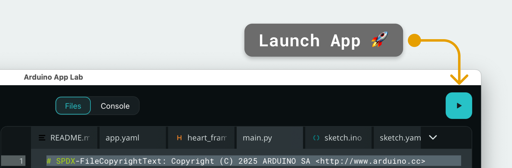
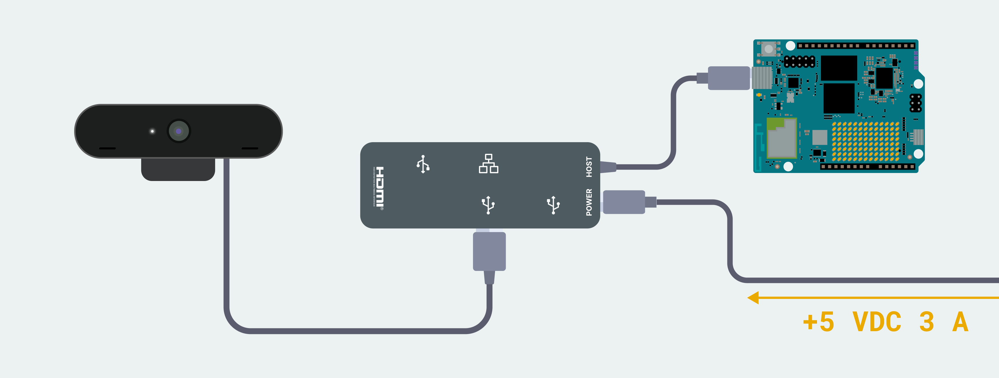

# Smart-Bins — AI-Powered Waste and Plagues Management

> Qualcomm Challenge · InterHack BCN
> Intelligent, connected, and built to keep cities clean.



## What is Smart-Bins?

Smart-Bins is an edge AI system that automates waste classification, deters urban wildlife, and gives sanitation teams real-time visibility into every bin across the city.

Built on the **Arduino Uno Q** with **Qualcomm on-device AI**, Smart-Bins tackles two of Barcelona's biggest urban sustainability challenges: incorrect recycling and animal infestations near waste collection points.

## The Problem

| Problem | Impact |
|---|---|
| Incorrect waste sorting | Contaminates recyclable streams, increases landfill |
| Animal infestations near bins | Public health risk, urban degradation |
| Inefficient collection routes | Wasted resources, overflowing bins |

## Our Solution

### Automatic Waste Classification
A top-mounted camera analyzes waste as it is deposited. A custom-trained AI model classifies it in real time into one of five categories — **Glass, Paper/Cardboard, Plastic/Packaging, Organic, or General Waste** — and mechanically redirects it to the correct bag.

### Animal Detection and Deterrence
The same camera monitors the surrounding perimeter at ground level. When a rat, pigeon, or wild boar is detected, the system activates **LED strobes and acoustic deterrents** to scare off the animal, safely and without harm.

### IoT Monitoring Dashboard
A real-time web platform gives sanitation teams full visibility into every bin: fill levels by waste type, animal activity alerts, and predictions on when each bin will need to be collected.

## Architecture

```
┌─────────────────────────────────────────────────┐
│                 Arduino Uno Q                   │
│                                                 │
│  ┌─────────────┐       ┌─────────────────────┐  │
│  │  STM32U585  │◄─────►│  Qualcomm QRB2210   │  │
│  │    (MCU)    │ Bridge│  Linux + AI Runtime │  │
│  │  C++ Sketch │       │  Python App         │  │
│  └──────┬──────┘       └──────────┬──────────┘  │
│         │                         │             │
│   Modulino Pixels           Logitech Camera     │
│   Modulino Buzzer           Edge Impulse Model  │
│   Modulino Distance         WebUI Dashboard     │
└─────────────────────────────────────────────────┘
                         │
                    REST API
                         │
              ┌──────────▼──────────┐
              │   Express API        │
              │   Node.js · Railway  │
              └──────────┬──────────┘
                         │
              ┌──────────▼──────────┐
              │   Dashboard          │
              │   Astro + React      │
              │   Vercel             │
              └─────────────────────┘
```

## Hardware and Tech Stack

### Hardware

| Component | Purpose |
|---|---|
| **Arduino Uno Q** | Dual-processor main board (MCU + MPU) |
| **Qualcomm QRB2210** | On-device AI inference |
| **STM32U585** | Real-time hardware control |
| **Logitech Brio 105** | Waste and animal detection camera |
| **Modulino Distance (VL53L4CD)** | Fill-level measurement  |
| **Modulino Pixels ×4** | LED alert and classification indicators |
| **Modulino Buzzer** | Acoustic animal deterrent |

### Software

| Layer | Tech |
|---|---|
| MCU firmware | C++ / Arduino (Zephyr RTOS) |
| MPU application | Python 3 / Arduino App Lab |
| AI inference | Edge Impulse — custom object detection model |
| MCU↔MPU communication | Arduino RouterBridge (RPC) |
| Backend API | Node.js + Express, deployed on Railway |
| Dashboard | Astro + React, deployed on Vercel |

## Backend API

Lightweight **Express** server running on Railway. Holds bin state in memory and serves it to the dashboard.

| Method | Endpoint | Description |
|---|---|---|
| `POST` | `/api/update-bin` | Push bin fill level from the board |
| `GET` | `/api/bins` | Get current state of all bins |

**POST `/api/update-bin`**
```json
{
  "id": "1",
  "postDistance": 245
}
```

**GET `/api/bins`** returns the in-memory state of every registered bin including fill level, last update timestamp, and animal incident count.

## The Dashboard



1. **Real-Time Map** — Geographic overview of all bins, color-coded: green (empty/mid), yellow (filling), red (critical).
2. **Deposit Status** — Fill level per waste fraction: Glass, Plastic, Paper, Organic, General.
3. **Predictive Analytics** — Estimates when each bin will reach capacity based on fill rate. Example: *"Will be full at 22:00 — 10h before scheduled collection."*
4. **Wildlife Incidents** — Timestamped log of animal detections with severity levels relative to historical averages.
5. **Historical Trends** — Per-bin fill rate history used to optimize collection schedules and cut unnecessary pickups.

## How It Works

```
Camera frame
     │
     ▼
Edge Impulse Model
     │
     ├── Waste label (verde / amarillo / azul)
     │         └── setWasteLed(color) → Modulino Pixels
     │
     └── Animal detected
               └── 10-frame consensus filter
                         └── setAnimalLed(ON) + Buzzer 10s
                                   └── POST /api/update-bin

Distance sensor (every 2s)
     └── Fill level → Dashboard + POST /api/update-bin
```

## Getting Started

### Prerequisites

- Arduino Uno Q
- `arduino-cli` + `arduino-app-cli`
- Python 3.11+
- ADB (Android Debug Bridge)
- Node.js 18+

### 1. Clone the repositories

```bash
# Board app
git clone https://github.com/your-org/smart-bins.git
cd smart-bins

# Backend (separate repo)
git clone https://github.com/your-org/smart-bins-backend.git
cd smart-bins-backend && npm install && node index.js
```

### 2. Connect to the board

```bash
adb devices
adb shell
bash
```

### 3. Deploy the app

```bash
arduino-app-cli app start /home/arduino/ArduinoApps/microwasteanimals
```

### 4. Compile and upload the sketch

```bash
cd sketch
arduino-cli compile --profile default
arduino-cli upload --profile default
```

### 5. Forward the dashboard port

```bash
adb forward tcp:7000 tcp:7000
```

Open [http://localhost:7000](http://localhost:7000).

## Project Structure

```
smart-bins/
├── sketch/                  # MCU firmware (C++ / Arduino)
│   ├── sketch.ino
│   ├── distance.h           # ToF sensor — fill level
│   ├── leds.h               # 4× Modulino Pixels control
│   ├── buzzer.h             # Acoustic deterrent
│   └── sketch.yaml          # Board profile and dependencies
├── python/                  # MPU application (Python)
│   └── main.py              # AI detections + Bridge + API
├── assets/                  # Web UI (served by WebUI brick)
│   ├── index.html
│   ├── app.js
│   └── style.css
├── app.yaml                 # App Lab configuration
└── README.md
```

## AI Model

The detection model runs on **Edge Impulse**, trained on custom datasets for waste classification and urban pest detection.

Detection uses a **10-frame consensus filter**: a label must appear in 10 consecutive frames before triggering any hardware action, eliminating false positives at runtime without retraining.

## Team

Built at **InterHack BCN** · Qualcomm Challenge. -- **Race Condition**
- Lucia Acedo
- Juan Carlos Diaz
- Xavier Román
- Joan Aranda
- Nil Babot
